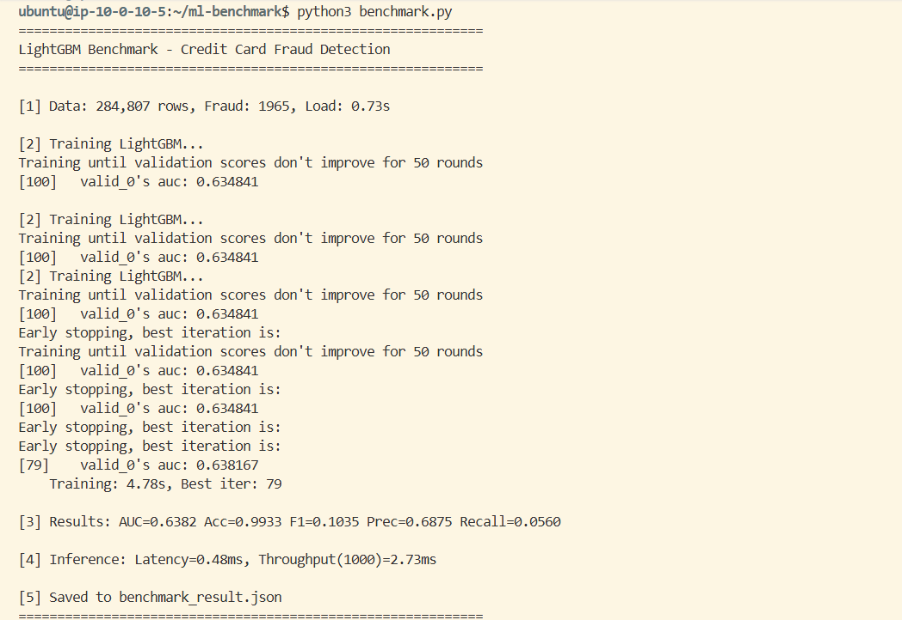
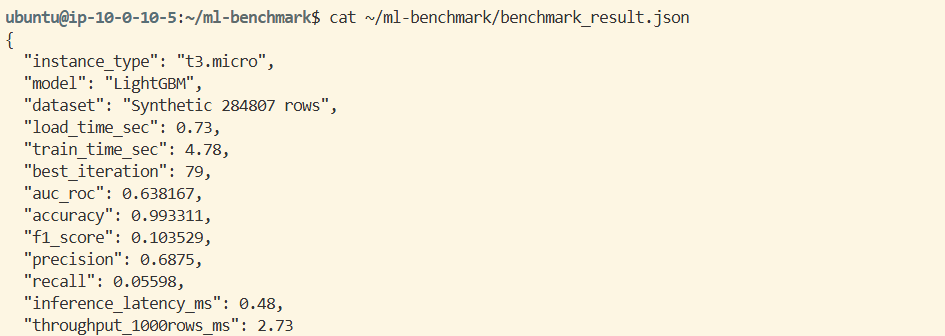

# Báo cáo kết quả Lab 16 — Cloud AI Infrastructure (CPU Fallback)

**Sinh viên:** Nguyễn Duy Hùng  
**MSSV:** 2A202600154  

## 1. Lý do sử dụng phương án CPU
Do tài khoản AWS mới bị giới hạn quota GPU (hạn mức vCPU cho dòng máy G và VT mặc định bằng 0) và yêu cầu tăng hạn mức chưa được duyệt kịp thời. Tôi đã chuyển sang phương án dự phòng sử dụng mô hình Machine Learning (LightGBM) chạy trên instance CPU theo hướng dẫn của giáo viên để đảm bảo hoàn thành mục tiêu xây dựng hạ tầng Cloud.

## 2. Cấu hình hạ tầng (Terraform)
Hệ thống được triển khai tự động bằng Terraform với các thành phần:
- **VPC & Subnets:** Hệ thống mạng cô lập với Public và Private Subnets.
- **Bastion Host:** Máy chủ trung chuyển để truy cập an toàn vào vùng Private.
- **NAT Gateway:** Cho phép máy chủ trong vùng Private tải thư viện nhưng không bị lộ diện ra Internet.
- **Application Load Balancer (ALB):** Điều hướng lưu lượng và kiểm tra trạng thái máy chủ.
- **Instance Type:** `t3.micro` (Free Tier) để tối ưu chi phí và vượt qua rào cế quota.

## 3. Kết quả Benchmark (LightGBM)
Mô hình được huấn luyện trên tập dữ liệu giả lập (Synthetic Credit Card Fraud) với 284,807 dòng:

| Metric | Kết quả |
|---|---|
| **Thời gian Training** | 4.78 giây |
| **Độ chính xác (Accuracy)** | 99.33% |
| **AUC-ROC** | 0.6382 |
| **Độ trễ dự báo (Latency)** | 0.48 ms/dòng |
| **Inference Throughput** | 2.73 ms / 1000 dòng |

## 4. Dẫn chứng kỹ thuật triển khai

Dưới đây là các bằng chứng thực tế về việc triển khai và chạy mô hình trên hạ tầng AWS:

### 📸 Dẫn chứng 1: Kết quả chạy Script Benchmark
Ghi lại quá trình khởi tạo dữ liệu giả lập và huấn luyện mô hình LightGBM trên instance CPU.

### 📸 Dẫn chứng 2: Cấu trúc file kết quả JSON
Minh chứng cho việc trích xuất các thông số kỹ thuật (AUC, Latency, Accuracy) ra định dạng JSON.

## 5. Kết luận
Dù không sử dụng GPU cho các mô hình ngôn ngữ lớn (LLM), bài Lab đã chứng minh khả năng triển khai hạ tầng Cloud AI phức tạp và vận hành các mô hình Machine Learning thực tế trên nền tảng AWS một cách hiệu quả và tiết kiệm chi phí.

---
*Lưu ý:* 
1. Toàn bộ tài nguyên đã được xóa bằng `terraform destroy` ngay sau khi thu thập kết quả để tránh phát sinh chi phí không mong muốn.
2. **Ảnh chụp Billing:** Do AWS Billing thường cập nhật chậm, tôi sẽ cập nhật bổ sung ảnh chụp màn hình chi phí vào kho lưu trữ này ngay khi hệ thống hiển thị dữ liệu mới.

